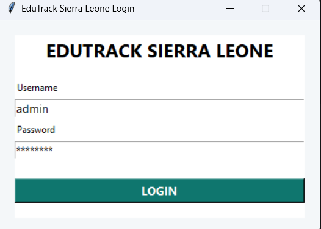
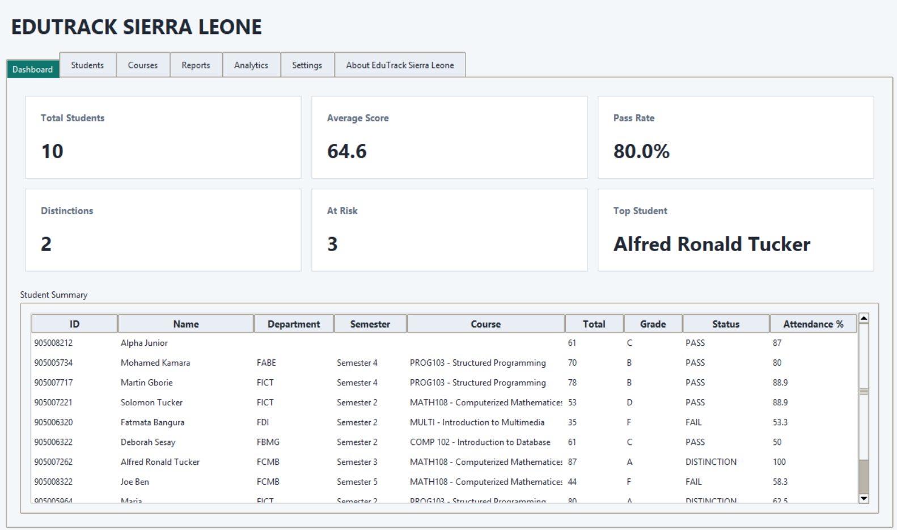
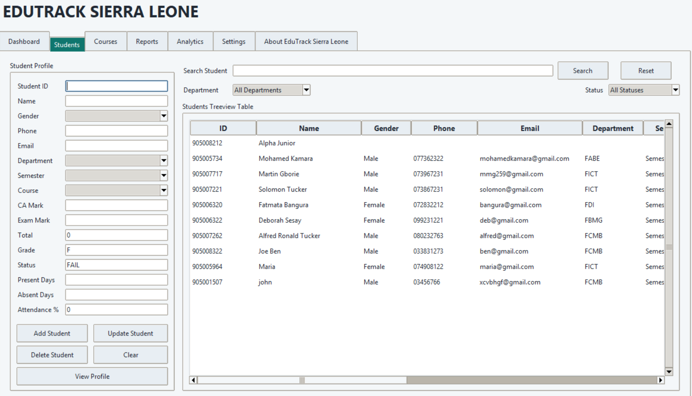
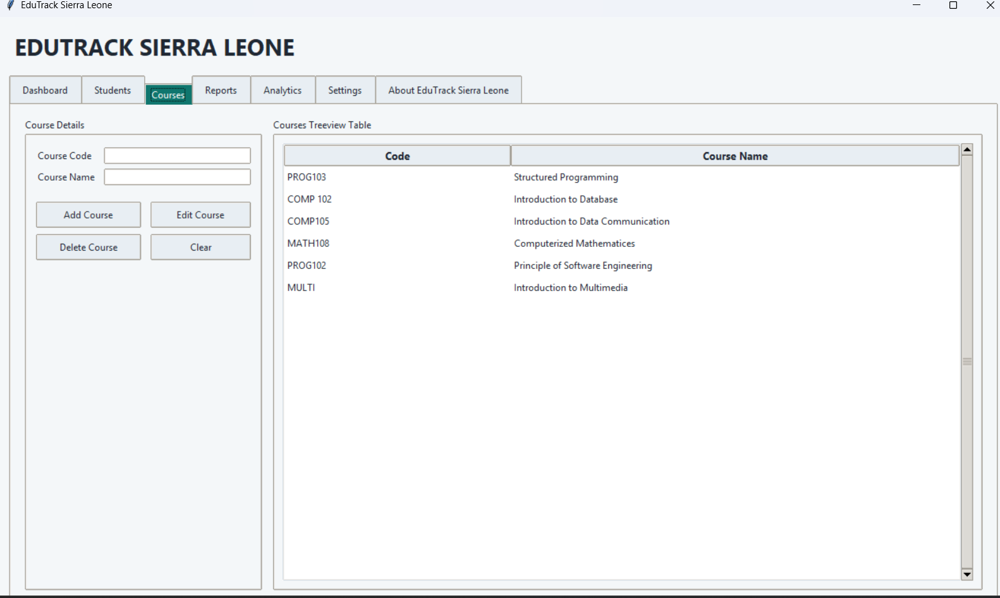
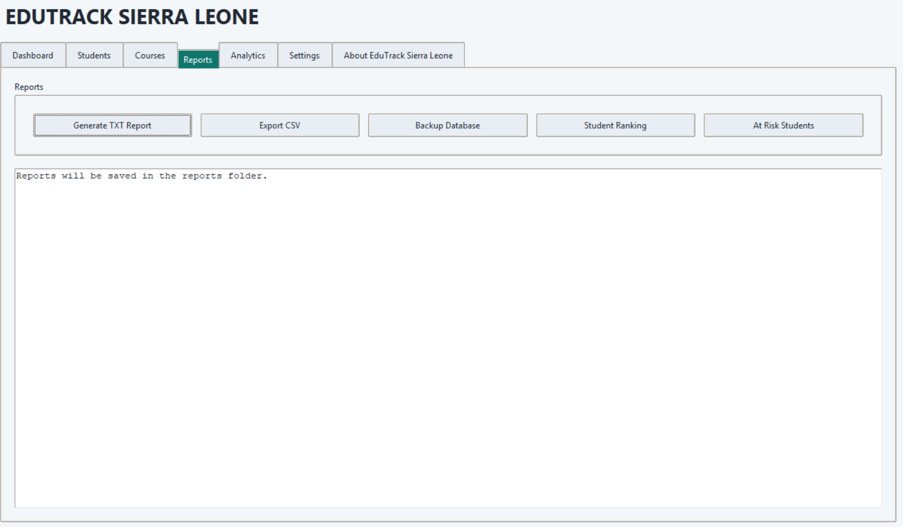
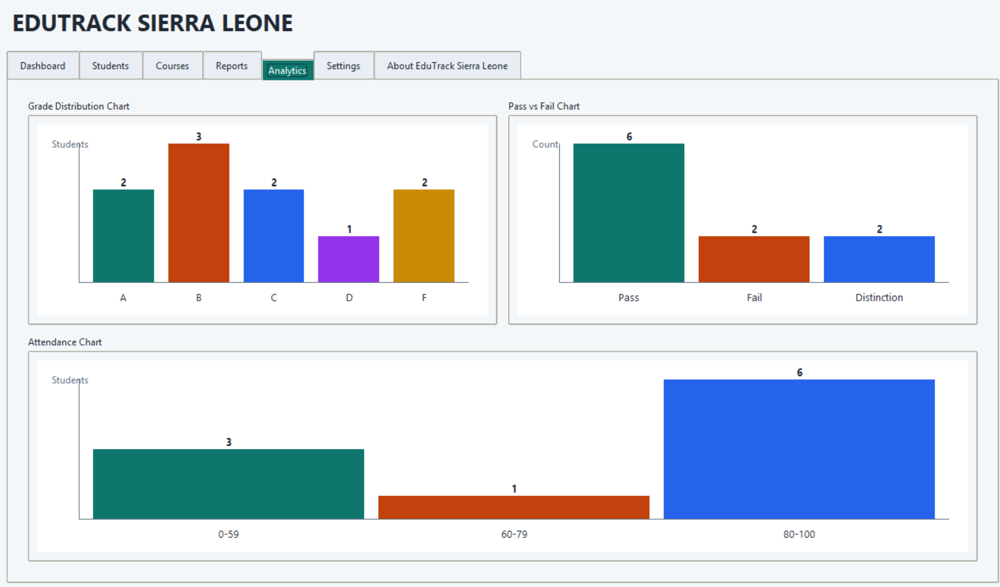

# EduTrack Sierra Leone

> A desktop-based Student Management System built with Python & Tkinter for educational institutions in Sierra Leone.


---

## 📋 Table of Contents

- [Overview](#overview)
- [Team](#team)
- [Objectives](#objectives)
- [Features](#features)
- [System Workflow](#system-workflow)
- [Grade Calculation Logic](#grade-calculation-logic)
- [Attendance Calculation Logic](#attendance-calculation-logic)
- [Project Structure](#project-structure)
- [Technologies Used](#technologies-used)
- [Testing & Validation](#testing--validation)
- [Future Improvements](#future-improvements)
- [SDG Alignment](#sdg-alignment)
- [Acknowledgements](#acknowledgements)

---

## Overview

**EduTrack Sierra Leone** is a fully-featured, desktop-based Student Management System developed as the Final Group Project for **PROG103 – Principles of Structured Programming** at **Limkokwing University of Creative Technology**.

The system provides educational institutions with a centralized platform for managing student records, tracking academic performance, monitoring attendance, generating reports, and identifying at-risk students — reducing manual paperwork and supporting data-driven decision-making.

### Core Programming Concepts Demonstrated

| Concept | Application |
|---|---|
| Functions & Modules | Modular system design with reusable components |
| File Handling | CSV export, TXT reports, database backup |
| Data Structures | Organized storage of student, course & attendance records |
| Error Handling | Input validation and graceful failure management |
| GUI Development | Full Tkinter-based graphical interface |
| Data Validation | Form-level checks across all modules |
| Reporting Systems | Automated report and analytics generation |

---

## Team

| Name | Role |
|---|---|
| **Michael Tucker** | Lead Developer & System Designer |
| **Maria Williams** | Authentication & Testing |
| **Andrew Bai Conteh** | System Analysis & Validation |

---

## Objectives

- Digitize student record management for educational institutions
- Improve academic monitoring through centralized data
- Reduce reliance on manual paperwork and administrative overhead
- Provide real-time performance analytics and trend visualization
- Generate automated, exportable reports (TXT & CSV)
- Track and calculate student attendance percentages
- Identify academically at-risk students early
- Support data-driven decision-making for educators and administrators

---

## Features

### 🔐 Login Authentication
Secure credential-based login system to restrict system access to authorized users only. Displays error messages for invalid attempts.

### 👤 Student Management
Full CRUD (Create, Read, Update, Delete) operations for student records. Manage personal details, enrollment status, and linked courses.

### 📚 Course Management
Add, edit, and remove course records. Associate courses with students and track course-level performance data.

### 📊 Academic Performance Management
Record and monitor student grades across subjects. Grades are automatically calculated and classified according to a structured grading scale.

### 🗓️ Attendance Management
Log attendance per student per session. The system calculates attendance percentages automatically based on recorded sessions.

### ⚠️ At-Risk Student Detection
Automatically flags students who fall below defined academic or attendance thresholds, enabling early intervention by educators.

### 🖥️ Dashboard
A centralized home screen displaying key metrics: total students, active courses, attendance summaries, and at-risk alerts at a glance.

### 📈 Analytics
Visual analytics and trend summaries across academic performance and attendance, helping educators identify patterns over time.

### 🗃️ Reports
One-click generation of detailed TXT reports and CSV exports covering student records, performance data, and attendance logs.

### 💾 Database Backup
Built-in backup functionality to create copies of the system database, protecting against data loss.

---

## System Workflow

```
User Login
    │
    ▼
Authentication Check
    │
    ├── ❌ Invalid → Error Message → Retry
    │
    └── ✅ Valid → Dashboard
                    │
          ┌─────────┼──────────┬────────────┬──────────┐
          ▼         ▼          ▼            ▼          ▼
      Students   Courses   Attendance  Performance  Reports
       (CRUD)    (CRUD)    Logging      Tracking    & Export
          │                   │            │
          └──────┬────────────┘            │
                 ▼                         ▼
         At-Risk Detection          Analytics View
                 │
                 ▼
         Backup & Export
```

---

## Grade Calculation Logic

Grades are assigned based on the following percentage scale:

| Score Range | Grade | Classification |
|---|---|---|
| 80 – 100 | A | Distinction |
| 70 – 79 | B | Merit |
| 60 – 69 | C | Credit |
| 50 – 59 | D | Pass |
| Below 50 | F | Fail |

Students scoring below the defined threshold are automatically flagged as at-risk in the dashboard.

---

## Attendance Calculation Logic

Attendance percentage is computed as:

```
Attendance % = (Sessions Attended / Total Sessions) × 100
```

Students falling below the minimum attendance threshold are flagged alongside academic at-risk indicators.

---

## Project Structure

```
EduTrack-SierraLeone/
│
├── main.py                  # Application entry point
├── login.py                  # Login & authentication logic
├── dashboard.py             # Dashboard UI and metrics
├── student.py              # Student management module
├── courses.py               # Course management module
├── attendance.py            # Attendance tracking module
├── performance.py           # Academic performance module
├── analytics.py             # Analytics and visualizations
├── reports.py               # Report generation (TXT & CSV)
├── backup.py                # Database backup utility
├── database/
│   └── edutrack.db          # Main SQLite database
├── backups/                 # Auto-generated backup files
├── reports/                 # Generated report outputs
└── screenshots/
    ├── login.png
    ├── dashboard.png
    ├── student_management.png
    ├── course_management.png
    ├── reports.png
    └── analytics.png
```

---

## Technologies Used

| Technology | Purpose |
|---|---|
| **Python 3.x** | Core programming language |
| **Tkinter** | Graphical User Interface (GUI) |
| **SQLite** | Local database storage |
| **CSV Module** | Data export functionality |
| **OS / Shutil** | File and backup management |

---

## Screenshots

### Login Screen


### Dashboard


### Student Management


### Course Management


### Reports


### Analytics


---

## Testing & Validation

The system was tested across a comprehensive set of scenarios to ensure correctness, reliability, and data integrity.

| Test Case | Expected Result | Status |
|---|---|---|
| Login with valid credentials | Access granted | ✅ Passed |
| Login with invalid credentials | Error message displayed | ✅ Passed |
| Add student record | Record saved successfully | ✅ Passed |
| Update student record | Record updated correctly | ✅ Passed |
| Delete student record | Record removed from system | ✅ Passed |
| Generate TXT report | Report file created | ✅ Passed |
| Export CSV | CSV file generated | ✅ Passed |
| Backup database | Backup file created | ✅ Passed |
| Calculate grades | Correct grade assigned | ✅ Passed |
| Attendance calculation | Correct percentage displayed | ✅ Passed |

---

## Future Improvements

- **Web Version** — Port the system to a browser-based platform (Flask/Django) for broader accessibility
- **SMS/Email Notifications** — Alert parents and students about at-risk status automatically
- **Multi-Role Access** — Separate login roles for admin, lecturer, and student
- **Data Visualization** — Enhanced charts and graphs using Matplotlib or Plotly
- **Cloud Backup** — Integration with cloud storage for remote database backup
- **Mobile App** — Companion mobile application for on-the-go access

---

## SDG Alignment

This project supports **UN Sustainable Development Goal 4 – Quality Education**, by:

- Providing digital tools that improve educational administration efficiency
- Enabling early identification of struggling students to reduce dropout rates
- Supporting evidence-based teaching practices through data and analytics
- Making academic management accessible to institutions with limited resources

---

## Acknowledgements

The development team would like to express sincere gratitude to:

- **Limkokwing University of Creative Technology**
- **Faculty of Information Communication and Technology (FICT)**
- Course Lecturers and Supervisors for their continued guidance
- Fellow students and testers for valuable feedback throughout development

---

## License

Copyright (c) 2026 Michael Tucker, Maria Williams, Andrew Bai Conteh

This project is licensed under the **MIT License** — you are free to use,
copy, modify, merge, publish, and distribute this software, provided the
original copyright notice and this permission notice are included in all
copies or substantial portions of the software.

See the [`LICENSE`](./LICENSE) file for full terms.

> **Academic Notice:** This software was developed as a Final Group Project for
> PROG103 – Principles of Structured Programming at Limkokwing University of
> Creative Technology. If used or referenced in academic or institutional
> contexts, appropriate credit to the original authors is kindly requested.

---

<div align="center">

**EduTrack Sierra Leone** — *Empowering Education Through Technology*

Developed by Michael Tucker · Maria Williams · Andrew Bai Conteh

PROG103 – Principles of Structured Programming
Limkokwing University of Creative Technology · © 2026

</div>

This project is licensed under the **MIT License**.

Copyright (c) 2026 EduTrack Sierra Leone Development Team

Permission is hereby granted, free of charge, to any person obtaining a copy
of this software and associated documentation files (the "Software"), to deal
in the Software without restriction, including without limitation the rights
to use, copy, modify, merge, publish, distribute, sublicense, and/or sell
copies of the Software, and to permit persons to whom the Software is
furnished to do so, subject to the following conditions:

The above copyright notice and this permission notice shall be included in all
copies or substantial portions of the Software.

THE SOFTWARE IS PROVIDED "AS IS", WITHOUT WARRANTY OF ANY KIND, EXPRESS OR
IMPLIED, INCLUDING BUT NOT LIMITED TO THE WARRANTIES OF MERCHANTABILITY,
FITNESS FOR A PARTICULAR PURPOSE AND NONINFRINGEMENT. IN NO EVENT SHALL THE
AUTHORS OR COPYRIGHT HOLDERS BE LIABLE FOR ANY CLAIM, DAMAGES OR OTHER
LIABILITY, WHETHER IN AN ACTION OF CONTRACT, TORT OR OTHERWISE, ARISING FROM,
OUT OF OR IN CONNECTION WITH THE SOFTWARE OR THE USE OR OTHER DEALINGS IN THE
SOFTWARE.

---

This project was developed as part of **PROG103 – Principles of Structured Programming** at **Limkokwing University of Creative Technology**.


<div align="center">

**EduTrack Sierra Leone** — *Empowering Education Through Technology*

Developed by Michael Tucker · Maria Williams · Andrew Bai Conteh

PROG103 – Principles of Structured Programming  
Limkokwing University of Creative Technology · © 2026

</div>